<h1 align="center">Hey  I'm Oldemar Gonçalves</h1>
<h3 align="center">Systems & DevOps Engineer | Full-Stack Developer | AI Enthusiast</h3>

  

## 📊 GitHub Stats & Trophies

  
  

  

  

## 🛠️ Languages & Tools

  

